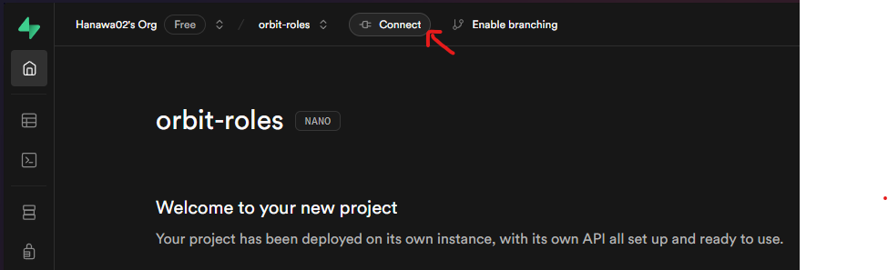
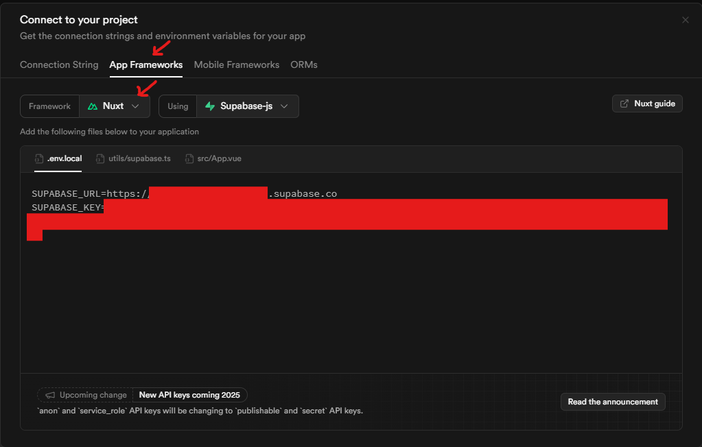
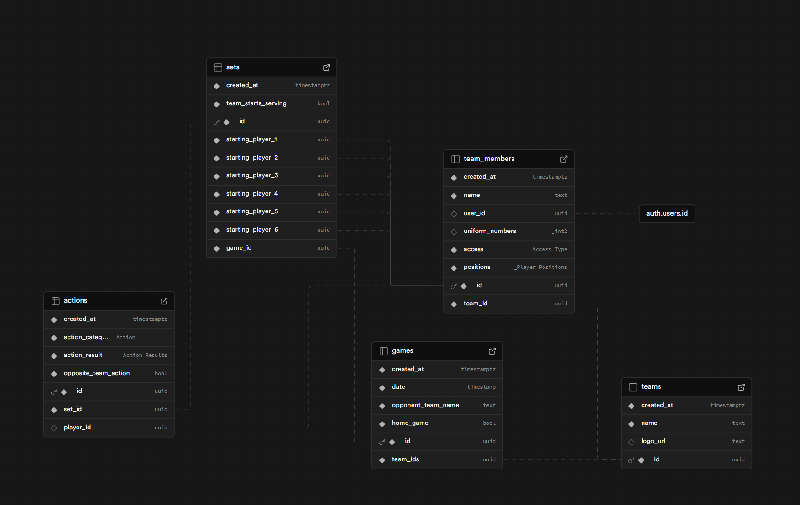

# Volley Stats (Nuxt)

Look at the [Nuxt documentation](https://nuxt.com/docs/getting-started/introduction) to learn more.

## Setup

Make sure to install dependencies:

```bash
npm install
```

Copy `.template.env` to `.local.env` or `.env`.

Go to your [Supabase dashboard](https://supabase.com/dashboard) and select your project to get the needed env variables.

- Click on Connect
  
- Select App Frameworks and `Nuxt` as a Framework
  
- Copy variables to `.env`

## Generating DB Types

1. Export the project id:

```bash
export PROJECT_ID="myProjectId"
```

2. Run `npm run codegen`

## Development Server

Start the development server on `http://localhost:3000`:

```bash
npm run dev
```

## Production

Build the application for production:

```bash
npm run build
```

Locally preview production build:

```bash
npm run preview
```

Check out the [deployment documentation](https://nuxt.com/docs/getting-started/deployment) for more information.

## Packages/Stack

- Supabase backend
- nuxt module for supabase
- [x] Tailwind
- [x] Localization
- [ ] Prettier
- [ ] EsLint
- [ ] Storybook (docs + test)

## Document

- [ ] How to setup Supabase project based on database types file (terraform/orm db)
- [ ] Concept of the project

## Features (in order of importance)

- [x] Add Team

  - [x] Add team members
    - [x] Allow multi selection for player positions
    - [x] Allow multi input for shirt number

- [x] Add Game
- [x] Add Set

  - [x] connect to backend
  - [x] Add validation for same player in multiple positions
  - [ ] ~ highlight players already in game

- [ ] Set Page

  - [ ] Add Action
    - [ ] Create Action Pop over
      - [ ] upper part with categories (attack, block, serve, etc)
      - [ ] lower part with action results (direct point, 1-touch point, in game, etc)
    - [ ] Add mini statistics on page (only players with some action)
      - [ ] Serve
      - [ ] Attack

- [ ] Basic statistics view
- [ ] Fix styling/design
- [ ] Fix copy
- [ ] transform everything to snake case
- [ ] improve data fetching by adding data to store

- [ ] Edit/Remove Team
- [ ] Edit/Remove team members
- [ ] Edit/Remove Game
- [ ] Edit/Remove Set
- [ ] Edit/Remove Action
- [ ] Undo Action?
- [ ] PDF Generator
- [ ] Redirect if no data found (in all pages)

- [ ] Google auth
- [ ] Generate/Invite team members as users
- [ ] Register with invitation link

  
